# Lead Management App (Lead)

<p align="center">
  
</p>

## Overview

Welcome to Lead, an advanced lead management app designed to streamline lead tracking, follow-ups, and communication. Lead is built using Flutter for the frontend, offering a smooth and intuitive user experience, and Firebase for the backend, ensuring seamless data management and real-time updates. This document serves as a comprehensive guide for developers and users to understand the key functionalities and setup of the Lead Management App.

## Features

1. **Lead Tracking**: Easily track and manage leads across various categories such as commercial, industrial, rental, residential, and others.
2. **Follow-up Management**: Maintain detailed records of follow-up interactions, including conversation logs, timestamps, and follow-up schedules.
3. **WhatsApp Integration**: Initiate follow-up conversations directly from the app using WhatsApp, without saving contacts to the phone.
4. **Lead Prioritization**: Mark important leads and prioritize follow-ups based on lead status and interest level.
5. **Contact Management**: Seamlessly save contacts to the app from existing phone contacts or speed dial, ensuring easy access and organization.
6. **Live Updates**: Receive real-time updates on lead status, including active, dead, and follow-up progress.
7. **Data Refinement**: Utilize advanced algorithms to refine lead data and identify genuine prospects interested in real estate or specific products/services.

## Getting Started

### Prerequisites

- Ensure you have Flutter and Dart installed. Follow the [official Flutter installation guide](https://flutter.dev/docs/get-started/install) for instructions.

## Installation

1. **Clone the repository:**

   ```bash
   git clone https://github.com/kakshaytyagi/LeadBoard-App
   ```

2. **Navigate to the project directory:**

   ```bash
   cd lead-management-app
   ```

3. **Install dependencies:**

   ```bash
   flutter pub get
   ```

## Screenshots

# Login Screens || SignUp Screen || Reset Password Screen

<div style="display: flex; justify-content: space-between;">
  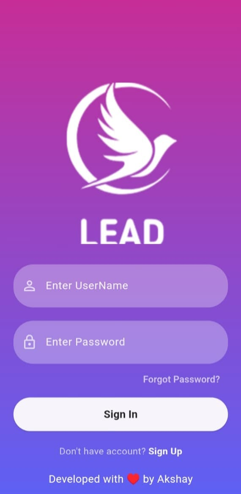
  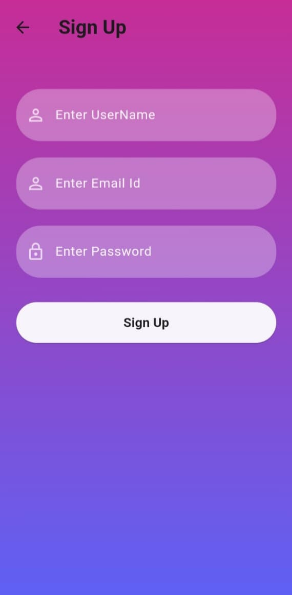
  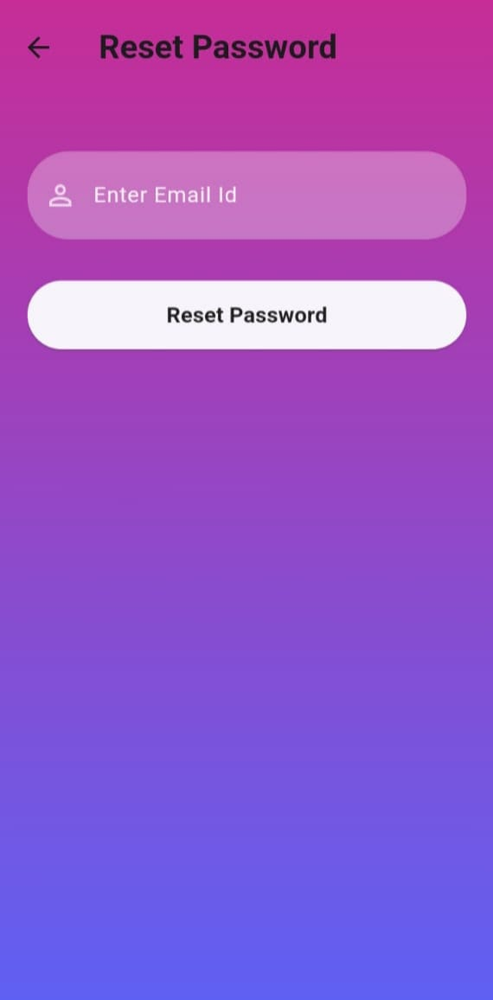
</div>

# Dashboard Screens || Contact Screen || Important Screen

<div style="display: flex; justify-content: space-between;">
  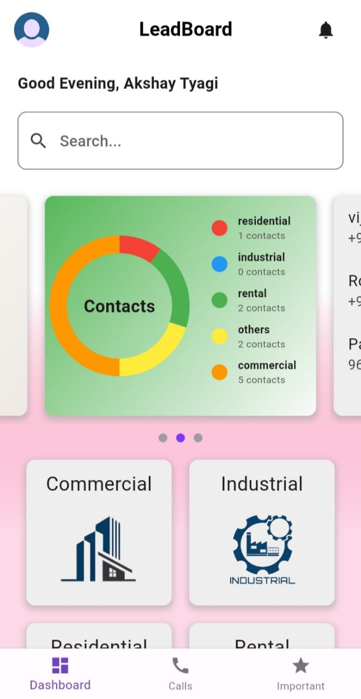
  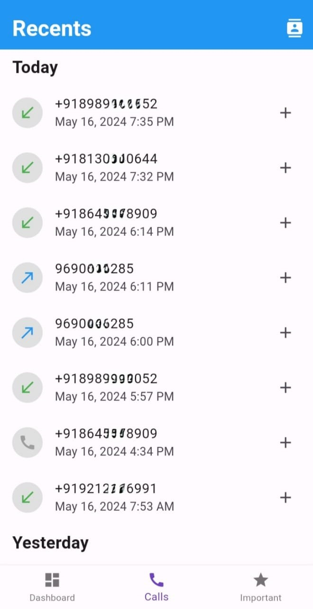
  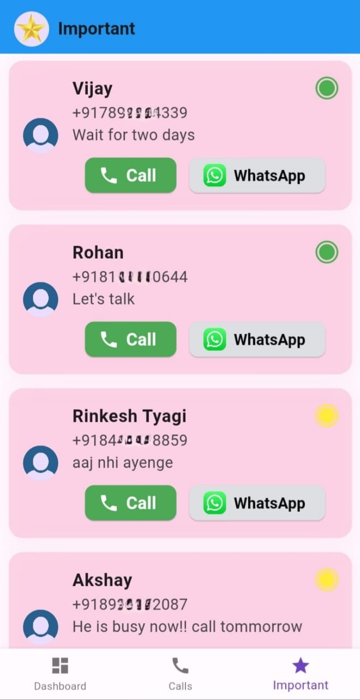
</div>

# Dashboard Screens

<div style="display: flex; justify-content: space-between;">
  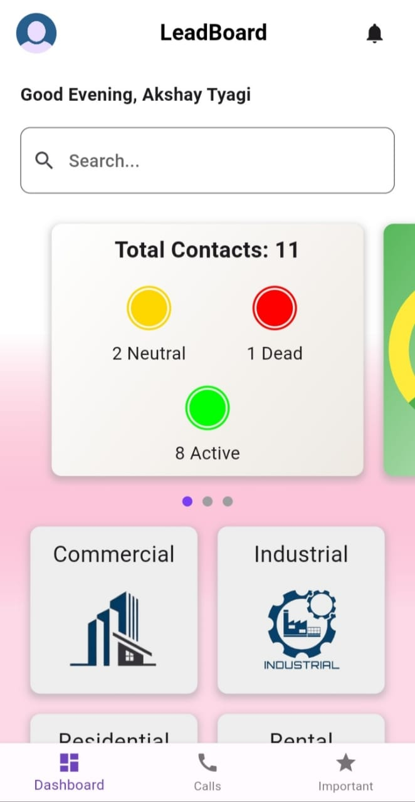
  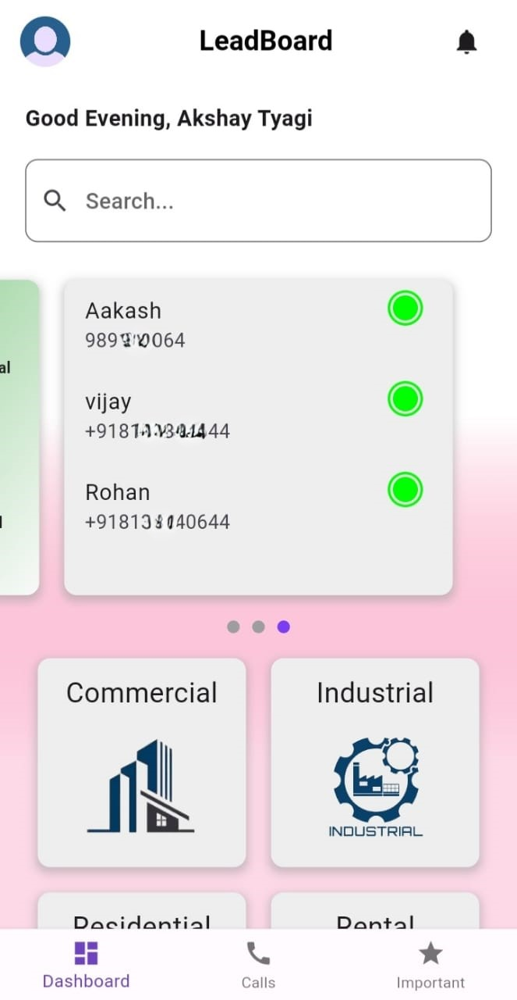
  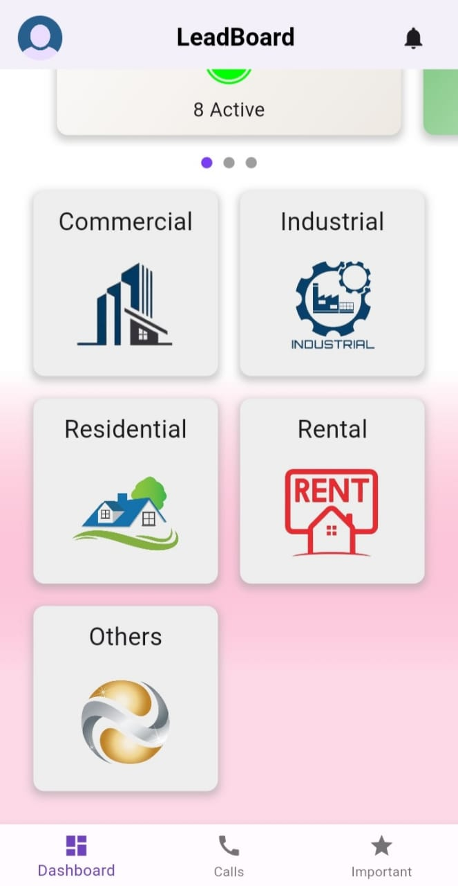
</div>

# Add Contact Screen
<div style="display: flex; justify-content: space-between;">
  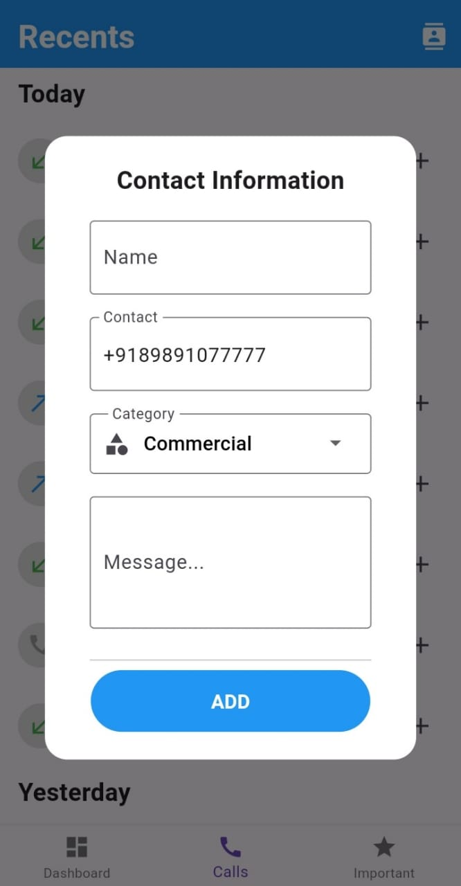
  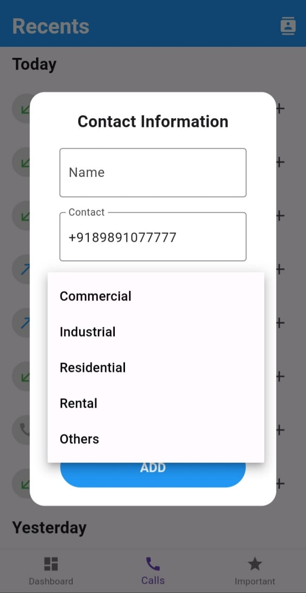
</div>

# Contact List || Chat Screen
<div style="display: flex; justify-content: space-between;">
  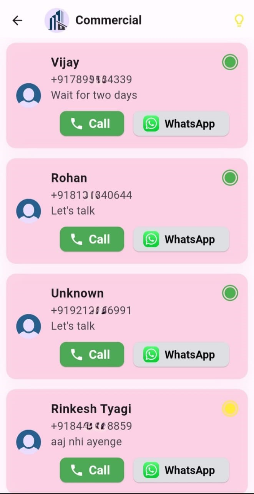
  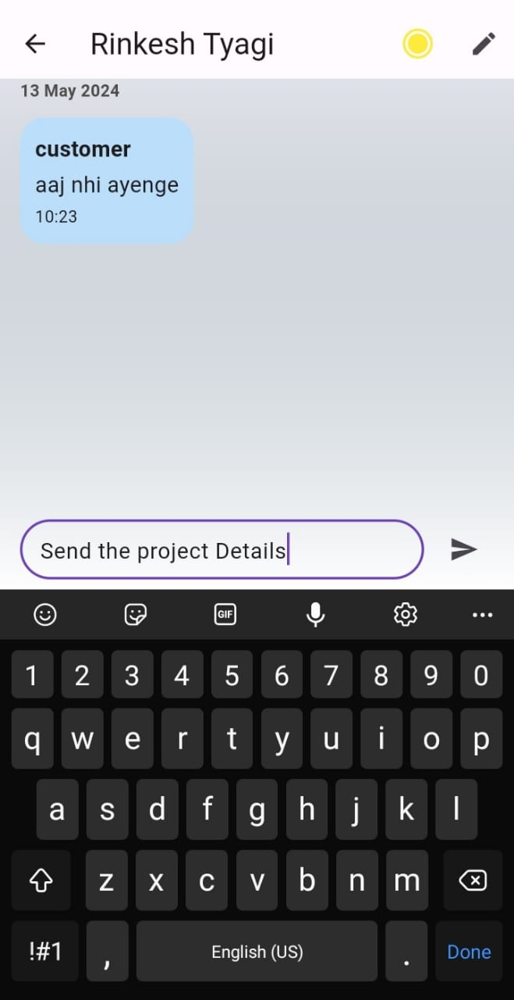
</div>

# Add Important Screen || Change Status(Active/Dead) || Author Screen 
<div style="display: flex; justify-content: space-between;">
  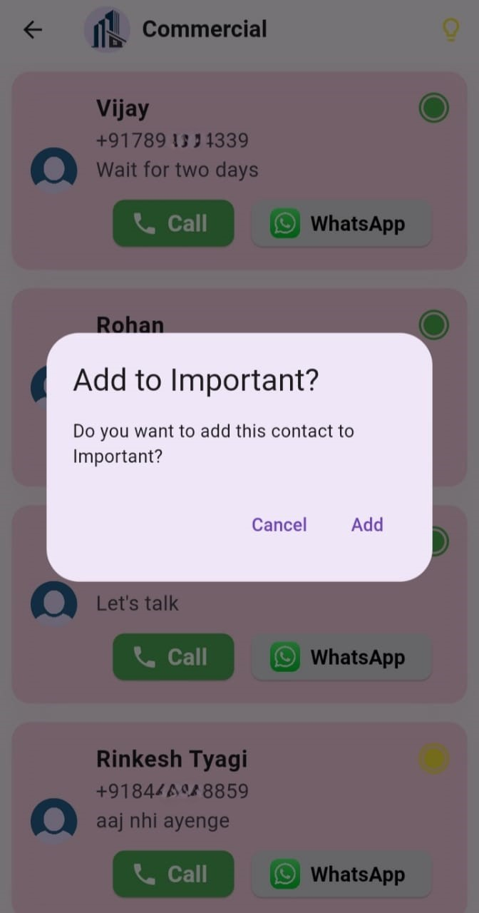
  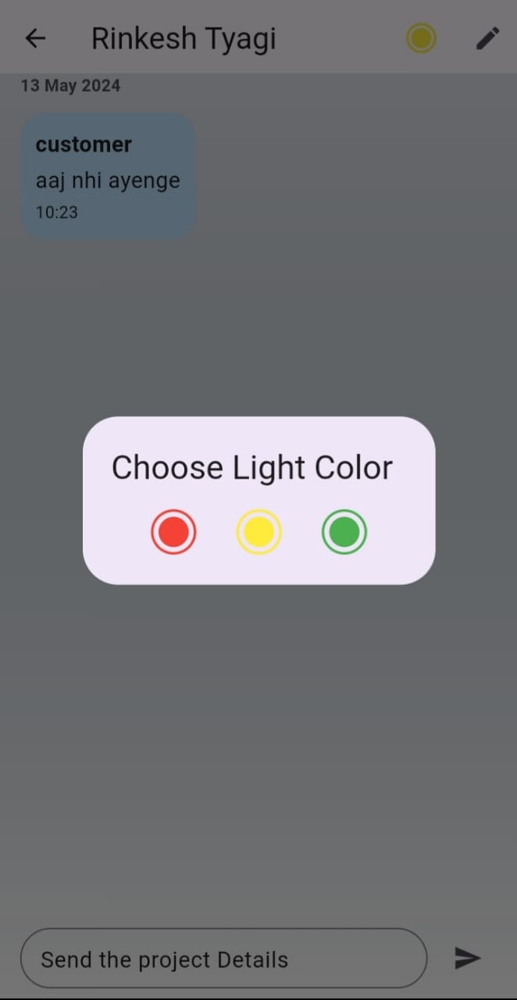
  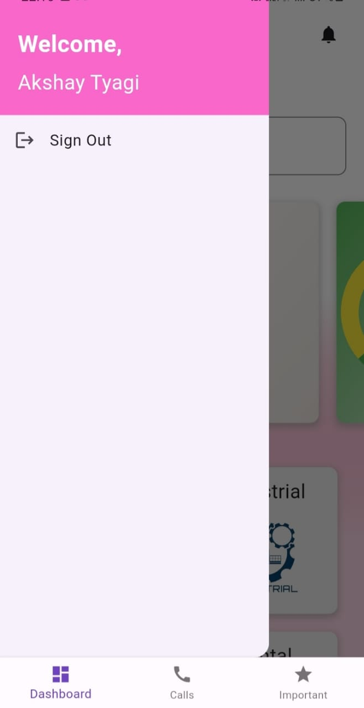
</div>

# Edit Name Screen || Empty Contact List Screen 
<div style="display: flex; justify-content: space-between;">
  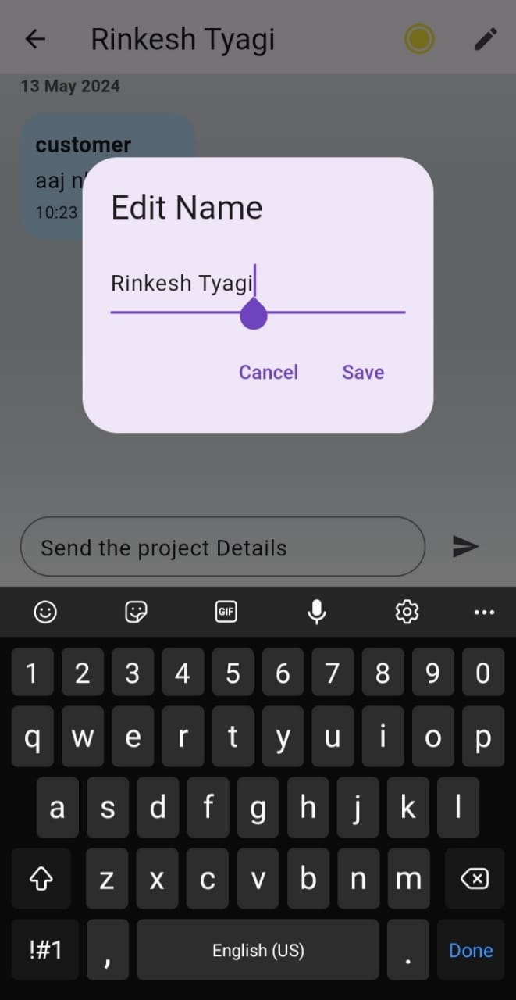
  
</div>


## Contributions

Contributions to the Lead Management App are welcome! If you encounter any issues, have suggestions for improvements, or would like to contribute new features, please feel free to open an issue or submit a pull request.

## License

This project is licensed under the kakshaytyagi License - contact for details.

## Acknowledgments

Special thanks to the Flutter community for their valuable resources and inspiration in creating this lead management solution.

- [Flutter Documentation](https://flutter.dev/docs)
- [Firebase Documentation](https://firebase.google.com/docs)
- [WhatsApp API Documentation](https://developers.facebook.com/docs/whatsapp)
  
For further assistance with Flutter development, refer to the [online documentation](https://flutter.dev/docs) for tutorials, samples, and a full API reference.
